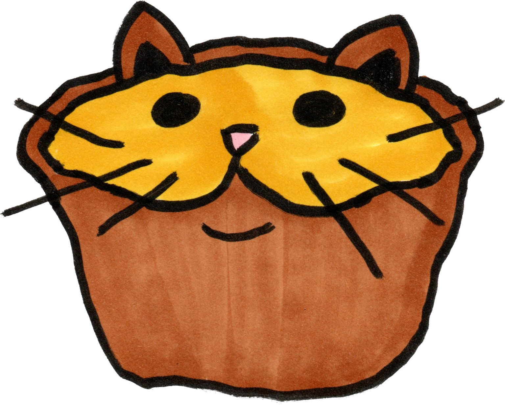
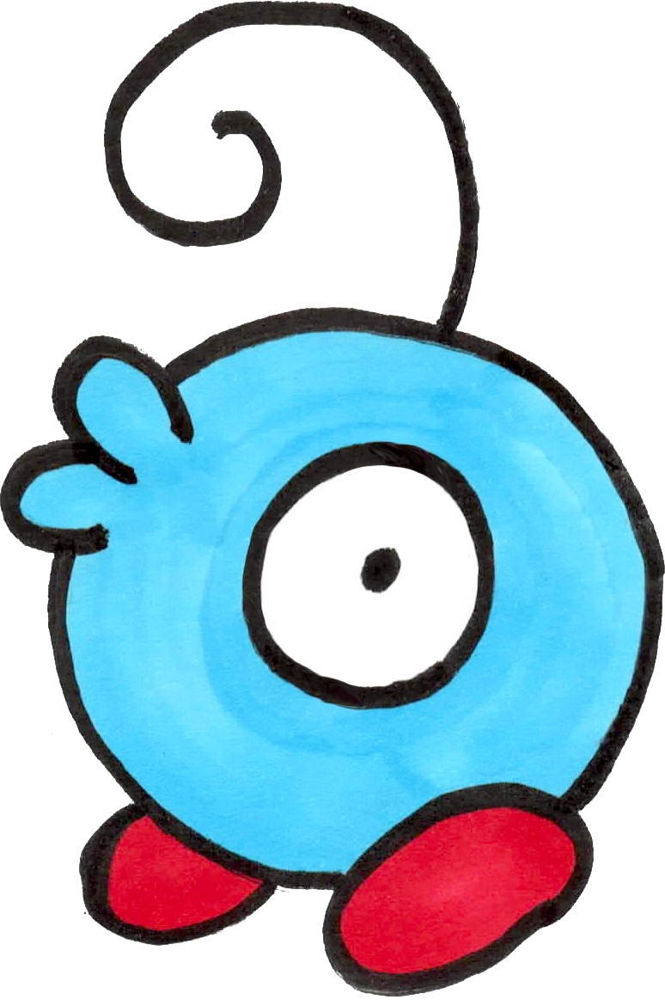
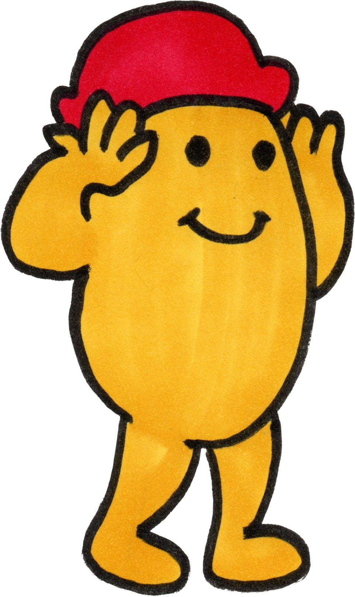
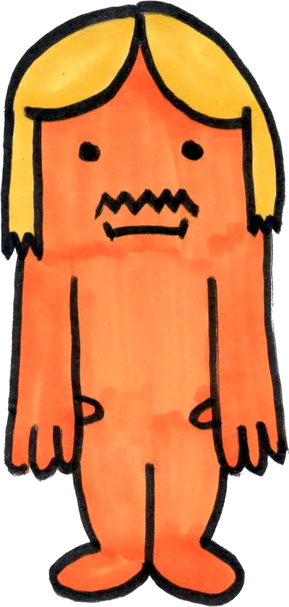
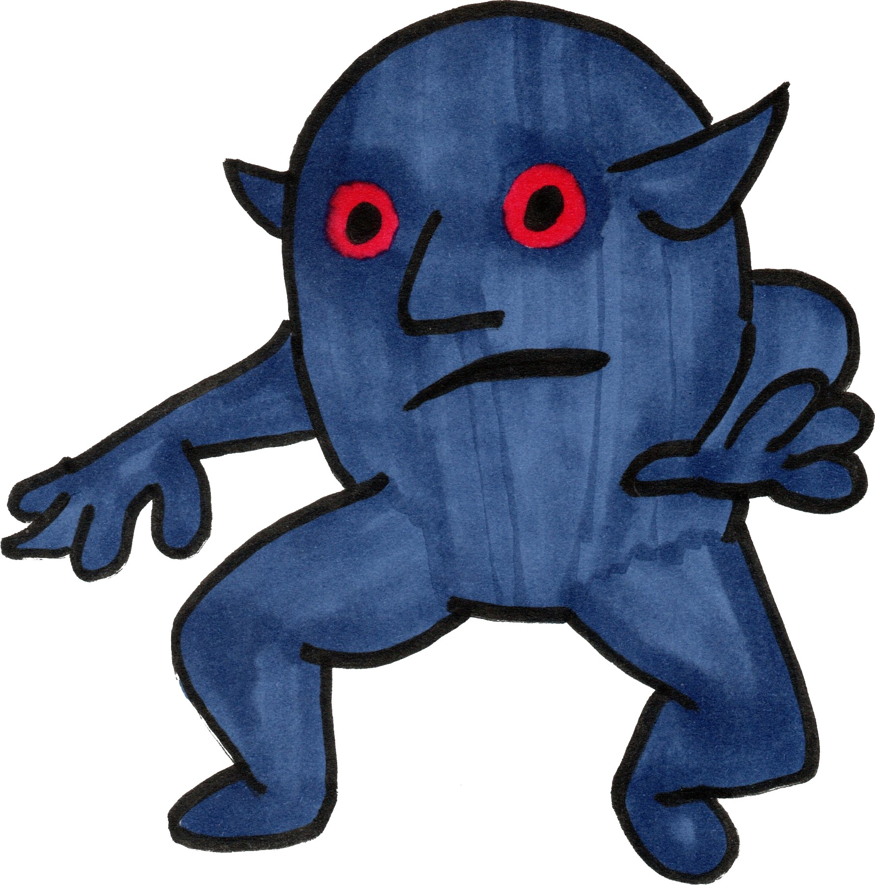
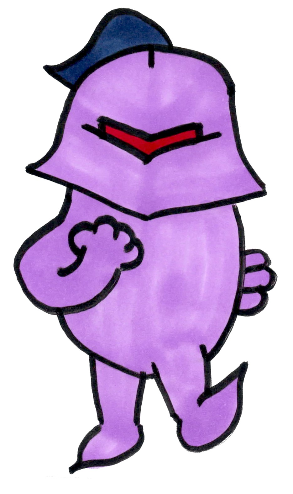

## LA COLLECTION «TWADO»!

Wow! Such livres!

Titres parus (incluant dans le futur et dans l'hypothétique):

*  [Madame JE-VEUX-PAS-DORMIR \
    ](./mme-je-veux-pas-dormir/text.pdf)

*  [Madame GOBELIN - à venir \
    ](./mme-gobelin/text.pdf)

*  [Madame NATA - à venir \
    ](./mme-nata/text.pdf)

*  [Madame FIN-DE-PHRASE - à venir \
    ](./mme-fin-de-phrase/text.pdf)

*  [Monsieur LETTE - à venir \
    ](./cossin/text.pdf)

*  [Monsieur GABOUÉ - à venir \
    ](./d-gaboue/text.pdf)

*  [Monsieur JE-SUIS-PAS-FATIGUÉ \
    ](./m-je-suis-pas-fatigue/text.pdf)

*  [Monsieur BABA - à venir \
    ](./m-baba/text.pdf)

*  [Monsieur ÇA-FAIT-LA-JOB - à venir \
    ](./m-ca-fait-la-job/text.pdf)

*  [Monsieur ARRÊTER-QUAND-JE-VEUX - à venir \
    ](./m-arreter-quand-je-veux/text.pdf)

*  [Monsieur TWADO - à venir \
    ](./m-twado/text.pdf)

*  [Monsieur MÉDIOCRE - à venir \
    ](./barnak/text.pdf)

## Idées:
* M. Arrêter-Quand-Je-Veux fait une journée de travail bien normale, mais il trimballe sa console
    partout et il n'est pas du tout présent.
* M. Twado - Lettres garbled, et images gravées apocalyptiques.
    On commence le conte avec l'histoire de l'arrivée de twado, c'est normal. C'est twado qui parle garbled

    > on faisait les tests de gestion d'escape de backslash dans le cours de compil
    > pis comme test case on s'est ramassé avec "\"twado" ou de quoi dans le genre
* M. Médiocre - Ça prend la tirade, le reste c'est TBD:
    Barnak: C'est une bonne chose, tout compte fait.
        Je vais te ridiculiser moi-même, tout en frappant l'aiguille durant l'eclispe.
        AINSI, LORSQUE TON PEUPLE VERRA LA LUNE CACHER LE SOLEIL, DANS MON CIEL, IL SAURA QUE TOUT EST PERDU POUR L'ÉTERNITÉ!
        MINABLE CHEVALIER!! BATS-TOI!!!
    Hype: NON, BARNAK!!! C'EST À TOI DE TE BATTRE!!!
        DIEU MÉDIOCRE!!! BATS-TOI!!!
* M. Gaboué -
* M. Lette - Pique-nique! Ninjas?

Retrouve tous tes héros sur https://twado.neocities.org \
Édité par diroum JEUNESSE, 2920, chemin de la tour, Montréal. \
Pas de dépôt légal. \
Définitivement hors la loi sur les publications destinées à la jeunesse.
